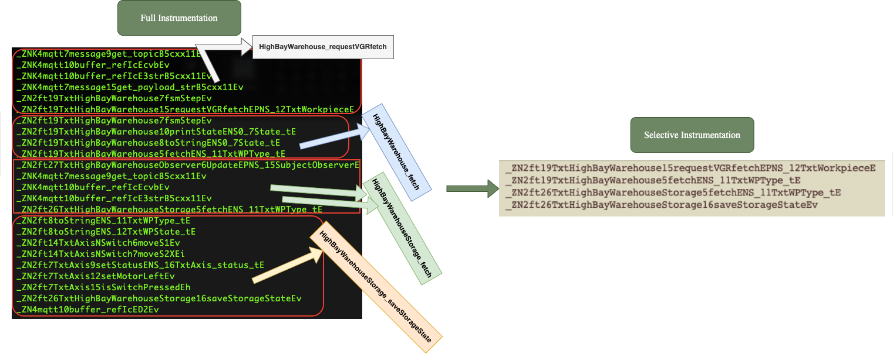

The above figure illustrates the process of reducing noise in function traces through selective instrumentation. The process involves three main steps to identify and isolate specific functional sequences (SFSes) that correspond to particular physical operations. Here is a detailed description of the full vs selective instrumentation:

#### Full Instrumentation (Left Side)
The left side of the figure shows the traces obtained from full instrumentation. These traces include numerous function calls, many of which are irrelevant to the core operation being analyzed. The blocks represent noisy functions associated with one core function.

Then after performing 3 steps, the core functions were selected,
 - Removal of C1 Noise: Identify and eliminate common patterns across various operations by preserving the distinct order of function calls specific to each operation.
 - Removal of C2 Noise: Preserve common patterns among multiple execution variants of the same operation by identifying constant sequences within the traces.
 - Removal of C3 Noise: Remove highly repetitive function calls by counting occurrences and setting an appropriate threshold for elimination.

#### Selective Instrumentation (Right Side)
The right side of the figure shows the result after applying the three-step process. The traces are significantly reduced and now only include the essential function calls related to the specific operation. As described above, the process involves first eliminating common patterns shared across different operations (C1 noise), then preserving consistent function call sequences within the same operation (C2 noise), and finally, removing highly repetitive functions that do not contribute to the core operation (C3 noise). As a result, the traces are refined to include only the essential function calls, as shown on the right side of the figure.

