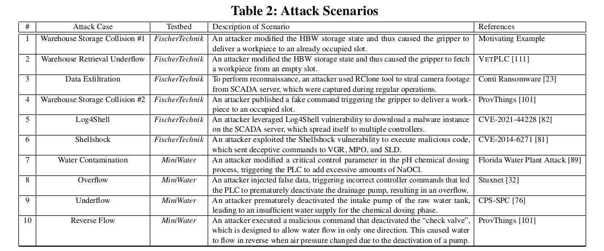

<table>
  <tr>
    <td>
        <strong>Due to truncation, 57 words (one sentence and references) are missing from our Rebuttal: </strong>
         
        [<strong>Static Analysis Precision(ReviewerA) ... </strong>Additionally, our goal is not to eliminate all false positives but to reduce them to the] extent that provenance graphs are small enough for humans to comprehend.
         
        [I] Darvas et al. "PLC program translation for verification purposes."
         
        [II] Adepu et al. “Control behavior integrity for distributed cyber-physical systems.”
         
        [III] “Granger causality”, https://en.wikipedia.org/wiki/Granger_causality.
         
        [IV] “Logix 5000 Controllers Tasks, Programs, and Routines”, https://literature.rockwellautomation.com/idc/groups/literature/documents/pm/1756-pm005_-en-p.pdf
         
        [V] Liu et al. “Towards a Timely Causality Analysis for Enterprise Security”, NDSS’18
    </td>
  </tr>
</table>
  

## Attack Scenarios
All the attack senarios of table 2 are explained below:

#### Warehouse Storage Collision #1:
In this scenario, an attacker modifies the High-Bay Warehouse (HBW) storage state, causing the gripper to store a workpiece in an already occupied slot. The fischertechnik testbed includes multiple controllers such as the HBW, Vacuum Gripper (VGR), and Sorting Line (SLD). This motivating example, detailed in section 3.1, involves the attacker tricking the system into believing that a specified location is empty when it is actually occupied. The HBW depends on the VGR to store and retrieve workpieces. As shown in Figure 2, the attack targets the HBW storage system, leading to an attempt to store a workpiece in an occupied slot. This vulnerability cannot be detected using program semantics, and we currently lack an effective tool to identify such attacks.

#### Warehouse Retrieval Underflow:
This scenario is similar to the motivating example, but here the attacker targets an empty slot. By altering the HBW storage state, the attacker causes the system to attempt to retrieve a workpiece from an empty slot. This is akin to the VetPLC[111] underflow attack, where certain tasks cannot be performed beyond a specific point, such as maintaining tank levels during water purification. As with the storage collision scenario, this type of attack cannot be understood using program semantics, and we lack a tool to identify such vulnerabilities.

#### Data Exfiltration:
Inspired by Conti ransomware attacks, we simulated a similar attack by stealing camera footage to gain detailed insights into regular operations. Using the RClone tool, we exfiltrated the footage from the SCADA server. This footage can reveal critical details about the system’s normal functioning, which could then be used to identify potential vulnerabilities and plan further attacks. This method mirrors the Conti approach of data theft and system infiltration, demonstrating the critical need for robust cybersecurity measures.

#### Warehouse Storage Collision #2:
In this scenario, an attacker issued a fake MQTT command, causing the gripper to deliver a workpiece to an already occupied slot. This attack involved publishing a deceptive command to manipulate the system into making an erroneous storage decision. Such vulnerabilities cannot be detected using program semantics, and we currently lack an effective tool to identify and prevent these types of attacks.

#### Log4Shell Exploit:
An attacker leveraged the Log4Shell vulnerability to download a malware instance onto the SCADA server, which then propagated to multiple controllers. This vulnerability affects Apache Log4j2 versions 2.0-beta9 through 2.15.0 (excluding security releases 2.12.2, 2.12.3, and 2.3.1). The JNDI features used in configuration, log messages, and parameters in these versions do not protect against attacker-controlled LDAP and other JNDI-related endpoints. This allows an attacker who can control log messages or log message parameters to execute arbitrary code loaded from LDAP servers when message lookup substitution is enabled.

In our simulation of the Log4Shell attack, we exploited the same vulnerability to introduce malware onto the SCADA server. This malware then spread across various controllers within the system. The attack method involved manipulating log messages to execute code from a remote LDAP server, taking advantage of the JNDI feature in vulnerable versions of Log4j. This type of attack cannot be effectively detected using current program semantics tools. The vulnerability relies on the execution of arbitrary code through manipulated log messages, which is outside the typical scope of what these tools can monitor or prevent. As a result, identifying and mitigating such exploits requires a different approach, such as updating to the latest secure versions of Log4j and implementing additional security measures to monitor and control external communications.

#### Shellshock:
An attacker exploited the Shellshock vulnerability to execute malicious code, which sent deceptive commands to the Vacuum Gripper (VGR), Material Processing Object (MPO), and Sorting Line Device (SLD). This attack involved leveraging the Shellshock flaw to manipulate the system's behavior through unauthorized command execution. These vulnerabilities cannot be detected using program semantics because program semantics focus on the intended logic and operations defined in the code, not on external inputs or the execution environment that can be manipulated by such vulnerabilities. The dynamic nature of these attacks, involving runtime exploitation and external command injection, falls outside the scope of static code analysis tools. Currently, no effective tool exists to identify such attacks.

#### Water Contamination:
An attacker modified a critical control parameter in the pH chemical dosing process, causing the Programmable Logic Controller (PLC) to add excessive amounts of sodium hypochlorite (NaOCl). This mirrors the Florida Water Plant Attack, where critical system parameters were tampered with to induce harmful conditions. Such vulnerabilities cannot be detected using program semantics, which are designed to verify the logical correctness of code, not to monitor real-time data manipulation or parameter changes by an attacker. No effective tool is currently available to identify these types of attacks.

#### Overflow:
An attacker injected false data, triggering incorrect controller commands that led the PLC to prematurely deactivate the drainage pump, resulting in an overflow. This scenario is similar to the Stuxnet attack, where manipulation of control data caused critical operational failures. Detecting such vulnerabilities using program semantics is not feasible because program semantics do not account for real-time data input anomalies or the environmental context in which the program operates. There is no effective tool available to identify these types of attacks.

#### Underflow:
An attacker prematurely deactivated the intake pump of the raw water tank, leading to an insufficient water supply for the chemical dosing phase. This kind of attack disrupts the balance of the system by cutting off essential resources. These vulnerabilities cannot be detected using program semantics, as they rely on unexpected changes in system behavior triggered by external inputs. There is no effective tool available to identify such attacks.

#### Reverse Flow:
An attacker executed a malicious command that deactivated the check valve, which is designed to allow water flow in only one direction. This caused water to flow in reverse when air pressure changed due to the deactivation of a pump. This type of attack compromises the integrity of the system's flow control mechanisms. Such vulnerabilities cannot be detected using program semantics, which do not encompass the dynamic and physical state changes induced by malicious commands. There is no effective tool available to identify these types of attacks.

In all these scenarios, the attacks exploit specific vulnerabilities to alter the normal operation of control systems. The complexity and specificity of these exploits make them undetectable using program semantics, and the lack of effective tools to identify these attacks underscores the need for advanced security measures and monitoring systems.
